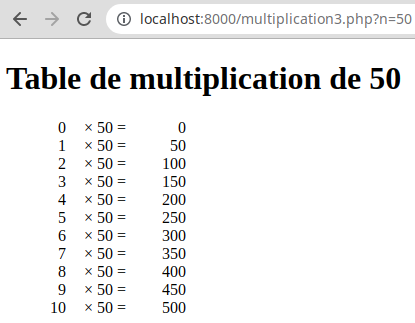

# Fichier nombre.html
- GET
	
- scheme
	- http
- host
	- localhost:8000
- filename
	- /nombre.html
- Adresse
	- 127.0.0.1:8000
- État
- 200
- OK
- VersionHTTP/1.1
- Transfert725 o (taille 567 o)
- Priorité de la requêteHighest

	
- Connection
	- close
- Content-Length
	- 567
- Content-Type
	- text/html; charset=UTF-8
- Date
	- Wed, 05 Apr 2023 07:22:22 GMT
- Host
	- localhost:8000
	
- Accept
	- text/html,application/xhtml+xml,application/xml;q=0.9,image/avif,image/webp,*/*;q=0.8
- Accept-Encoding
	- gzip, deflate, br
- Accept-Language
	- fr,fr-FR;q=0.8,en-US;q=0.5,en;q=0.3
- Connection
	- keep-alive
- Host
	- localhost:8000
- Sec-Fetch-Dest
	- document
- Sec-Fetch-Mode
	- navigate
- Sec-Fetch-Site
	- none
- Sec-Fetch-User
	- ?1
- Upgrade-Insecure-Requests
	- 1
- User-Agent
	- Mozilla/5.0 (X11; Ubuntu; Linux x86_64; rv:102.0) Gecko/20100101 Firefox/102.0

 

# Fichier multiplication3.php (avec le nombre 50)
- GET
	
- scheme
	- http
- host
	- localhost:8000
- filename
	- /multiplication3.php
- n
	- 50
- Adresse
	- 127.0.0.1:8000
- État
- 200
- OK
- VersionHTTP/1.1
- Transfert2,83 Ko (taille 2,67 Ko)
- Politique de référentstrict-origin-when-cross-origin
- Priorité de la requêteHighest

	
- Connection
	- close
- Content-type
	- text/html; charset=UTF-8
- Date
	- Wed, 05 Apr 2023 07:23:21 GMT
- Host
	- localhost:8000
- X-Powered-By
	- PHP/8.1.17
	
- Accept
	- text/html,application/xhtml+xml,application/xml;q=0.9,image/avif,image/webp,*/*;q=0.8
- Accept-Encoding
	- gzip, deflate, br
- Accept-Language
	- fr,fr-FR;q=0.8,en-US;q=0.5,en;q=0.3
- Connection
	- keep-alive
- Host
	- localhost:8000
- Referer
	- http://localhost:8000/nombre.html
- Sec-Fetch-Dest
	- document
- Sec-Fetch-Mode
	- navigate
- Sec-Fetch-Site
	- same-origin
- Sec-Fetch-User
	- ?1
- Upgrade-Insecure-Requests
	- 1
- User-Agent
	- Mozilla/5.0 (X11; Ubuntu; Linux x86_64; rv:102.0) Gecko/20100101 Firefox/102.0

 

# Rendu final (multiplication3.php)

 
3. Description de l'URL http://localhost:8000/multiplication3.php?n=50

- Le protocole est http.
- Le nom de domaine du serveur est localhost:8000.
- Le nom du fichier est /multiplication3.php.
- le Query String correspond à ?n=50
	- Le paramètre n est égal à 50.

4. Si le paramètre est changé manuellement dans l'URL, le rendu du fichier multiplication3.php change.

5. Ici, le Query String est utilisé par la méthode GET qui récupère le paramètre dans un formulaire du fichier nombre.html. Le paramètre peut être modifié à l'intérieur de celui ci.

6. Le paramètre "hello", étant une chaîne de caractères, ne peut pas être multipliée par un entier.

7. Le calcul précédent est impossible donc la page renvoie un Fatal Error.

8. La fonction **is_int()** ne fonctionne pas car la méthode GET renvoie n sous forme de chaîne de caractères.

9. Utilisation de la fonction **isset()** qui vérifie si la variable est null ou non.

11. Lorsque l'on retire le paramètre de l'URL, la page nous renvoie un Fatal Error.

12. Le paramètre est vide donc ne correspond à aucun type et donc ne peut pas être null.

13. Utilisation de la fonction **empty()** qui vérifie si la variable est vide ou non.
